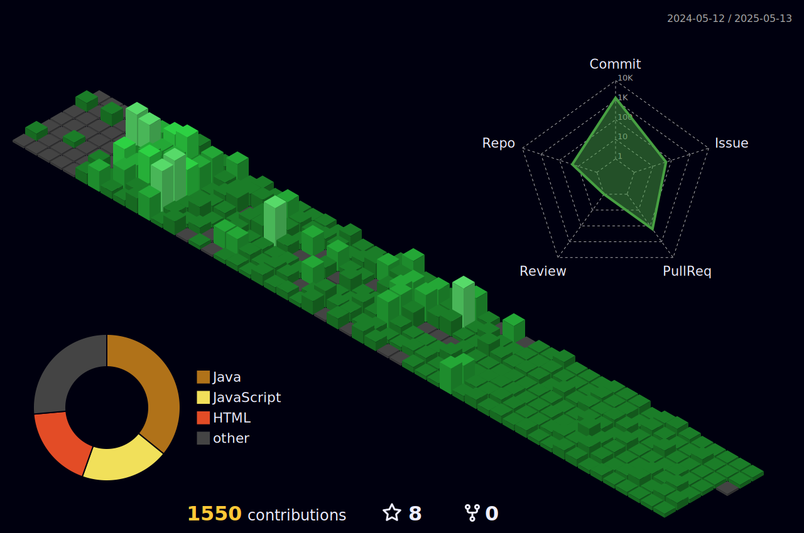

### 
: 🔥성실한 개발자가 되자🔥 : 안녕하세요! 정현민입니다.

  
   

   
  

  

## 
🛠️Tech Stacks🛠️

  <!-- Back-End -->
  
<strong>Back-End</strong>

   
  

    

      
      
      
       
    

  

<!-- Front-End -->

<strong>Front-End</strong>

  

    

      
      
      
      
    

  

  <!-- DevOps -->

<strong>DevOps</strong>

  

    

      
      
      
      
      
    

  

  <!-- 요즘 진행하는 프로젝트 -->

<strong>Project ~ing</strong>

  

    

      <!-- 마리모 웹페이지 제작 중.. (1/14 ~ ) -->
    

  

